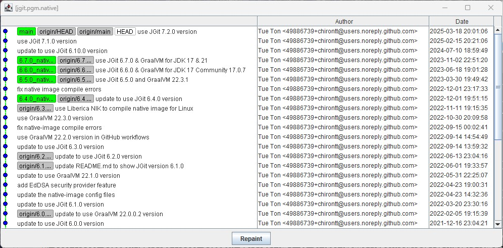

# Native executable for command-line JGit program (PGM)

[JGit PGM](https://github.com/eclipse-jgit/jgit/tree/master/org.eclipse.jgit.pgm), part of the Eclipse [JGit](https://github.com/eclipse-jgit/jgit) [project](https://projects.eclipse.org/projects/technology.jgit),
is the stand-alone command-line Java program which provides Git commands similar
to the native [git](https://git-scm.com) commands, to access Git repositories.

Usually distributed as a jar package, JGit [PGM](https://github.com/eclipse-jgit/jgit/tree/master/org.eclipse.jgit.pgm)
is also distributed as a stand-alone, self-contained (with all dependencies), executable shell archive,
from Maven Central, like
[this](https://repo1.maven.org/maven2/org/eclipse/jgit/org.eclipse.jgit.pgm/7.2.1.202505142326-r/org.eclipse.jgit.pgm-7.2.1.202505142326-r.sh)
of the 7.2.1 version. This shell archive is then normally renamed to `jgit` locally for ease of typing.

On Linux, the shell archive can be run directly.
On Windows, the shell archive can be run with the `java` command, like:
`java -jar org.eclipse.jgit.pgm-6.7.0.202309050840-r.sh --version`

This project aims to produce platform-specific, native executable `jgit` of the JGit PGM
using the [GraalVM native-image](https://www.graalvm.org/reference-manual/native-image) utility,
complementing the shell archive distribution.

Gradle and Maven build scripts are provided for building the project. The latest JGit version used here is [7.2.0](https://projects.eclipse.org/projects/technology.jgit/releases/7.2.0).

## Build pre-requisites

The [GraalVM native-image](https://www.graalvm.org/reference-manual/native-image) page
shows how to set up GraalVM and its native-image utility for common platforms.
[Gluon](https://gluonhq.com/) also provides some setup [details](https://docs.gluonhq.com/#_platforms)
for GraalVM native-image creation.

Actually, because this PGM application can produce a graphical window showing the commit logs,
via the command `jgit glog`, e.g.:

and thus for a *Swing-based application* like this PGM project, an implementation of GraalVM called
the [Liberica Native Image Kit](https://bell-sw.com/pages/downloads/native-image-kit/)
can produce a *working* native executable better than the stock
[GraalVM-CE](https://github.com/graalvm/graalvm-ce-builds) software could, for some reason.
This Liberica NIK software is used in the GitHub Actions
[build scripts](https://github.com/chirontt/jgit.pgm.native/tree/main/.github/workflows)
of this project to successfully build and generate the relevant *working* native images for Linux and Windows.

The GraalVM native-image utility will use the configuration files in
`src/graal-cfg/<platform>/META-INF/native-image` folder to assist in the native image generation.

## Gradle build tasks

To run the JGit PGM in standard JVM with Gradle, execute the `run` task
with relevant parameters as needed:

	gradlew run --args="--version"
	gradlew run --args="ls-remote <some-repo-url>"
	gradlew run --args="clone <some-repo-url>"
	gradlew run --args="glog"
	etc.

To produce a native executable, execute the `nativeCompile` task:

	gradlew nativeCompile

The `nativeCompile` task would take a while to compile the application and link into an executable file.
The resulting `jgit` executable file is:

	build/native/nativeCompile/jgit

(or if building on a Windows machine, the executable file is:

	build\native\nativeCompile\jgit.exe

)

which can then be run directly (with relevant parameters):

	./build/native/nativeCompile/jgit --version
	./build/native/nativeCompile/jgit ls-remote <some-repo-url>
	./build/native/nativeCompile/jgit clone <some-repo-url>
	./build/native/nativeCompile/jgit glog
	etc.

(or if building on a Windows machine:

	build\native\nativeCompile\jgit.exe --version
	build\native\nativeCompile\jgit.exe ls-remote <some-repo-url>
	build\native\nativeCompile\jgit.exe clone <some-repo-url>
	build\native\nativeCompile\jgit.exe glog
	etc.

)

## Maven build tasks

To compile and run the JGit PGM in standard JVM with Maven, execute the
`compile` then `exec:exec` task with relevant parameters as needed:

	mvnw compile
	mvnw exec:exec -Djgit.args="--version"
	mvnw exec:exec -Djgit.args="\"ls-remote <some-repo-url>\""
	mvnw exec:exec -Djgit.args="\"clone <some-repo-url>\""
	mvnw exec:exec -Djgit.args="glog"
	etc.

To produce a native executable, execute the `package` task:

	mvnw package

The `package` task would take a while to compile the application and link into an executable file.
The resulting `jgit` executable file is:

	target/jgit

(or if building on a Windows machine, the executable file is:

	target\jgit.exe

)

which can then be run directly (with relevant parameters):

	./target/jgit --version
	./target/jgit ls-remote <some-repo-url>
	./target/jgit clone <some-repo-url>
	./target/jgit glog
	etc.

(or if building on a Windows machine:

	target\jgit.exe --version
	target\jgit.exe ls-remote <some-repo-url>
	target\jgit.exe clone <some-repo-url>
	target\jgit.exe glog
	etc.

)

